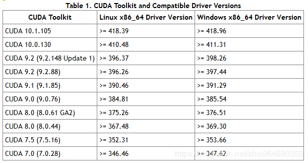

## 1 Linux系统下利用anaconda创建虚拟环境并安装pytorch0.4.1和torchvision
https://blog.csdn.net/amateur_hy/article/details/90716411

+ conda install pytorch torchvision cudatoolkit=9.0 -c pytorch

利用以上命令，可同时安装PyTorch和torchvision，但PyTorch的版本为1.1，而所需PyTorch版本为0.4.1，因此不能采用以上命令进行配置，而是要分别安装PyTorch 0.4.1和torchvision。

pytorch官网提供了previous versions of PyTorch安装选项，可根据需求进行安装。

### 安装pytorch 0.4.1

+ conda install pytorch=0.4.1 cuda90 -c pytorch

以上是cuda9.0版本的安装命令。

### 安装torchvision

- conda install torchvision

## 2 使用 PyTorch 测试 CUDA 是否安装成功
很简单，只要下面两行代码：

- import torch 
- print(torch.cuda.is_available())

返回结果是 True，则 PyTorch 的 GPU 安装成功；否则就是没有成功。
## 3 Ubuntu 查看 cuda 及 cudnn 版本
查看 CUDA 版本：
- nvcc -v
- cat /usr/local/cuda/version.txt

查看 CUDNN 版本：

- cat /usr/local/cuda/include/cudnn.h | grep CUDNN_MAJOR -A 2

## 4 CUDA对应的NVIDIA驱动版本对照表

## 5 pytorch指定版本安装及查看版本

https://blog.csdn.net/u013187057/article/details/81484857?utm_source=blogkpcl15

